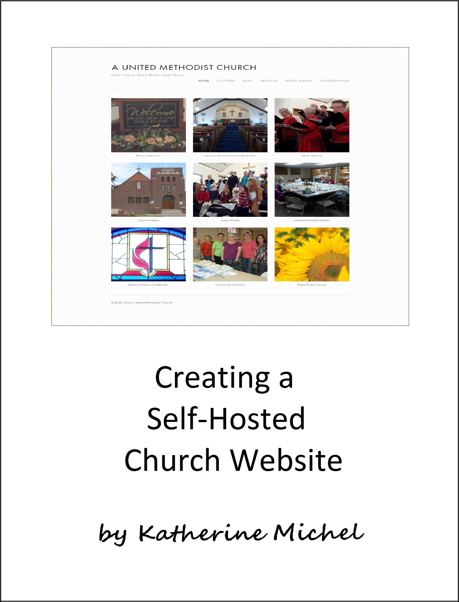

# Creating a Self-Hosted Church Website

A GitBook Documenting My Experience of Creating a Self-Hosted Church Website

Table of Contents
* [About](README.md)
* [Introduction](introduction.md)
* [Design](design/design.md)
   * [Squarespace Website](design/squarespace-website.md)
   * [Starter Templates](design/starter-templates.md)
   * [Self-Hosted Website](design/self-hosted-website.md)
   * [Before and After](design/before-and-after.md)
* [Jekyll Approach](coding-approaches/jekyll-approach.md)
* [Django Approach](coding-approaches/django-approach.md)
* [Open-Source GitHub Organization](open-source-github-organization.md)
* [Lessons Learned](lessons-learned.md)

GitBook: http://www.gitbook.com/book/katherinemichel/creating-a-self-hosted-church-website/
  
GitHub repo: https://github.com/KatherineMichel/creating-a-self-hosted-church-website

© [Katherine Michel](http://katherinemichel.github.io) 2016

