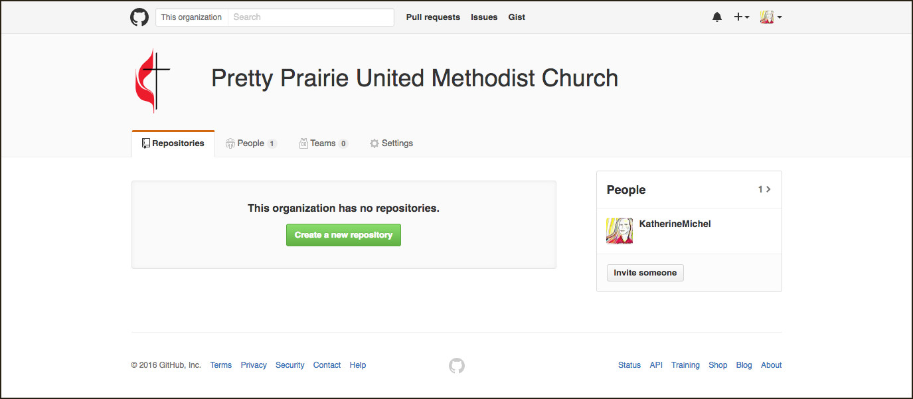
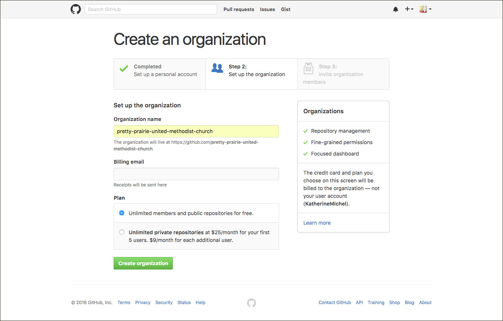
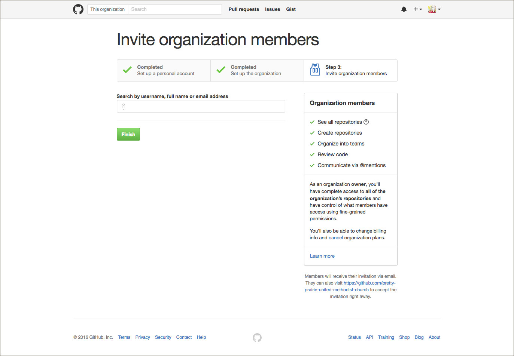
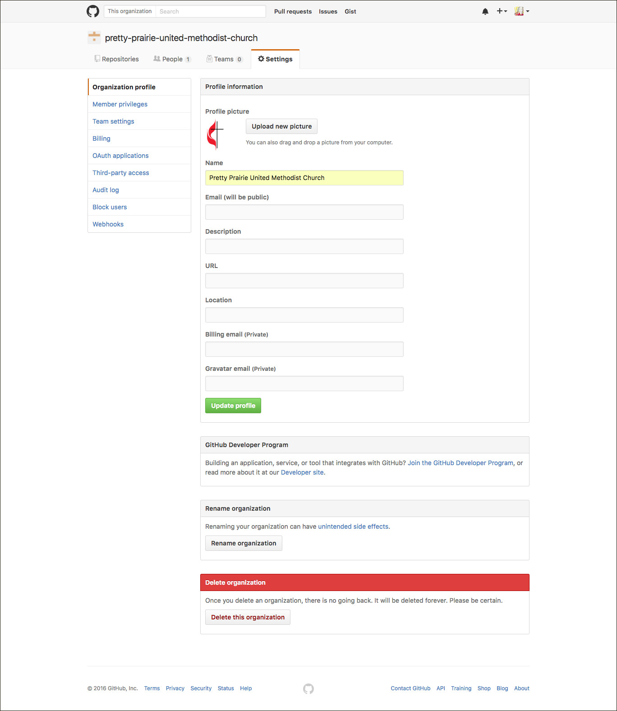
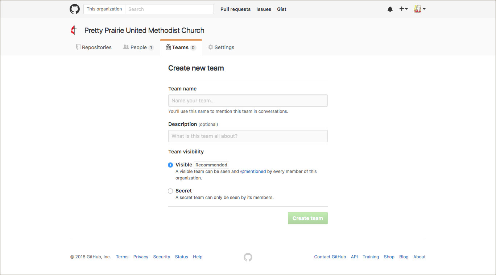

# Open-Source GitHub Organization

[GitHub](https://github.com) is the most popular place in the world for hosting open-source code. GitHub is a website built on top of the version control system [Git](https://en.wikipedia.org/wiki/Git_(software) ). Linus Torvalds, the founder of Linux, a highly successful open-source operating system, created Git for his own use as the head maintainer of Linux, to coordinate contributions from developers around the world. GitHub provides users with a dashboard that makes Git more user-friendly and also serves as a collaborative environment for open-source developers. GitHub can be used in two primary ways: through a personal account or an organization account. Anyone can create a personal GitHub account, create a "repo" and store code there. If the repo is public, anyone can look through, learn from, and contribute to the code. Anyone can submit a change to a repo (this is called a pull request), but the account owner or an organization member will need to review the contribution to decide whether to merge it with the existing code-base or reject it. Unsolicited code contributions are not likely to occur on a small project. 

Although GitHub is most often used by developers, increasingly more community organizations are using it to make their code open-source. Even a church could create a GitHub organization account, where a few people could access website code to make simple updates, such as publishing a new blog post. There is more about this topic in the [Jekyll Approach](administration/jekyll-admin.md) section. 

Below are screenshots showing what a church GitHub organization would look like and the setup process. 

Organization account with me as owner

Create an organization

Invite organization members

Update the settings with proper name and profile picture

Create a team

