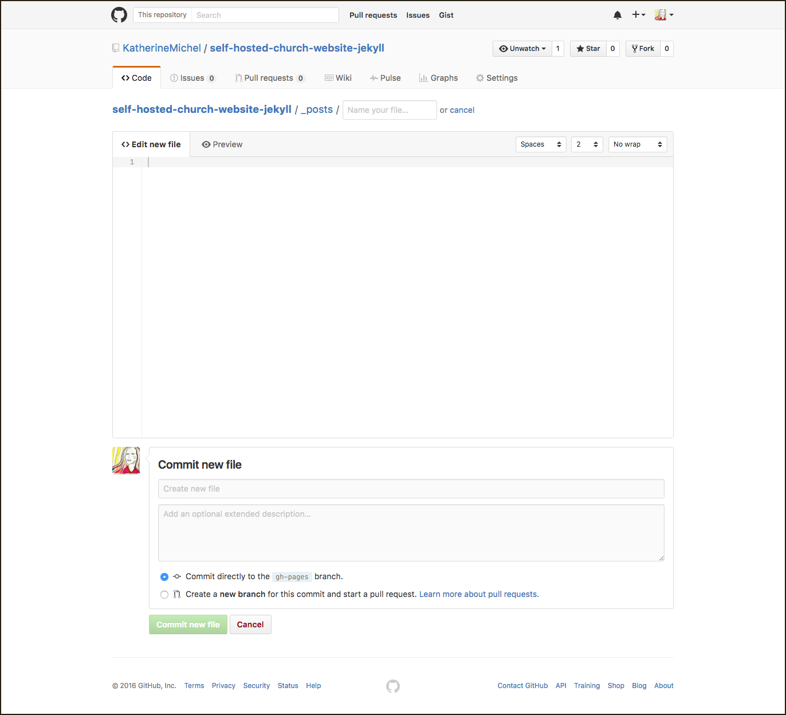

# Jekyll Approach

Finished self-hosted [website](https://katherinemichel.github.io/self-hosted-church-website-jekyll) and [code](https://github.com/KatherineMichel/self-hosted-church-website-jekyll/tree/gh-pages) 
Compare to the original [Squarespace website](http://www.prettyprairieumc.org)

## Background

[Jekyll](https://jekyllrb.com) is a web development framework created at [GitHub](https://github.com), the most popular place in the world for hosting open-source code. Jekyll sites can be hosted for free at GitHub and many individuals and organizations on GitHub use it as a convenient way to introduce themselves. Jekyll is user friendly, combining powerful web development features with free, easy development. However, Jekyll is a static framework that does not offer all traditional web development functionality. Whether it is right for a specific project needs to be evaluated on a case-by-case basis. 
 
## Jekyll Pros and Cons

Pros
* Can be hosted for free at GitHub
* Many Jekyll code-bases on GitHub to learn from
* Fairly easy to deploy
* Can use a custom domain

Cons
* Static framework (as opposted to dynamic)
* Limited functionality

## Cost Comparison

Squarespace website
* $144/year basic, custom domain included
* Cost of labor, if any

Jekyll Site
* [Free to host on GitHub](https://help.github.com/articles/using-jekyll-as-a-static-site-generator-with-github-pages)
* Cost of domain (~$10)
* Cost of labor, if any

## Tools Needed for This Project

* [Jekyll](https://jekyllrb.com)
* [Start Bookstrap Unstyled Starter Templates](http://startbootstrap.com/template-categories/unstyled)
* [GitHub](https://github.com) personal or organizational account, in order to use GitHub gh-pages
* Optional: CNAME file (for custom domain)
* Optional: [Disqus](https://disqus.com) (for blog post comments)

## Staged Deployment

In a mission critical, live production environment, a website may be updated and viewed locally (on an individual computer), before the new code is pushed to the web host and viewed on a live staging site that is virtually the same as the live production site. If the result on the staging site is satisfactory, the change may be pushed to the live site where it will be seen by users. It is assumed that a website made using the approach given in this GitBook will be simple/low traffic enough that major updates could be verified locally and pushed directly to gh-pages. Minor changes, such as adding a blog post, could be completedly directly in GitHub in the browser. However, it is possible that a staging site could be created by making a staging branch, and merging the staging branch with the gh-pages branch. 

## Administration

Any person making updates to the site will need to have a personal GitHub account. If the code-base is hosted in a GitHub organization account, any person who needs to have website admin privileges will need to be a member of the organization account. Anyone can submit a contribution to a code-base (this is called a pull request), but the account owner or an organization member will need to review the contribution to decide whether to merge it with the code-base or reject it. Unsolicited code contributions are not likely to occur on a small project. 

It is expected that the majority of the website will remain largely unchanged. Changes made by non-developers will be isolated. For example, a part of the website that would be updated often would be the blog. Updating the blog is not any more difficult than creating a word document, writing some text and saving it. 

Here are the steps for a person who is an account owner or organization member: 

In GitHub, navigate to the website repo and double click the name

For a non-root gh-pages repo (does not end in github.io) choose the gh-pages branch

Click on the _blog folder to open it

Copy the contents of the blog post template by open the file, copying and clicking "Cancel" or clicking raw

Click the "Create new file" button in the upper right

New File

When the file opens, paste the contents of the blog post template into the new file

In the "Name your file" box, type the date and blog post title with hyphens (exclude other punctuation such as apostrophes) followed by .markdown

Replace the generic "Front matter," with the information for this blog post (for example: title)

Under the "Front matter," type or copy and paste your blog post text

When you are happy with your post, scroll to the bottom of the page and click the green "Commit new file" button

The post will automatically populate a blog post description on the blog homepage with a link to an automatically populated blog post page
