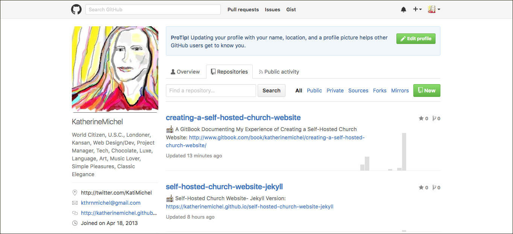
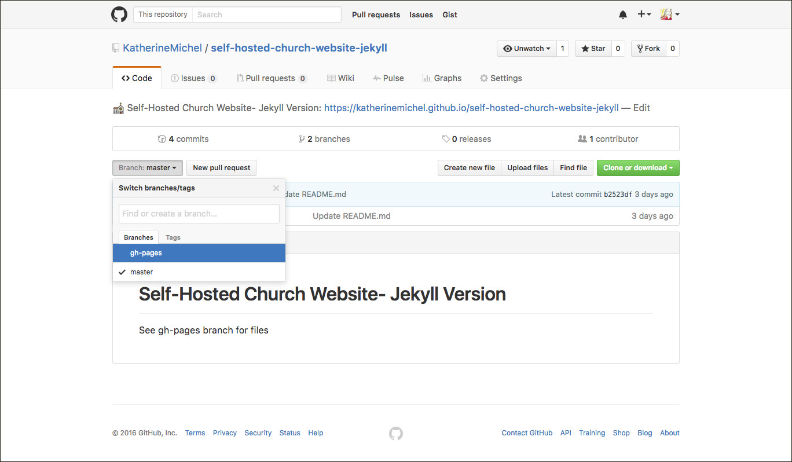
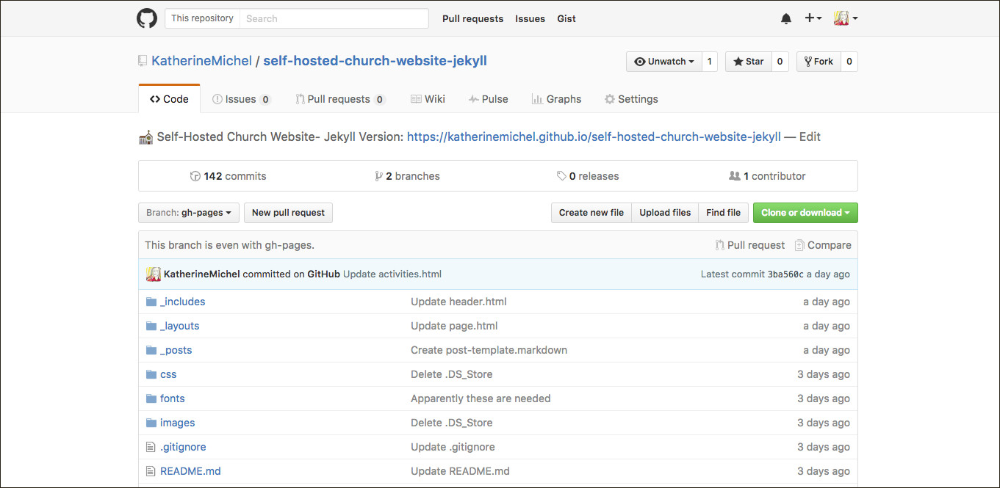
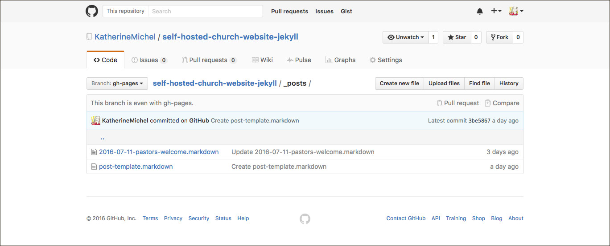
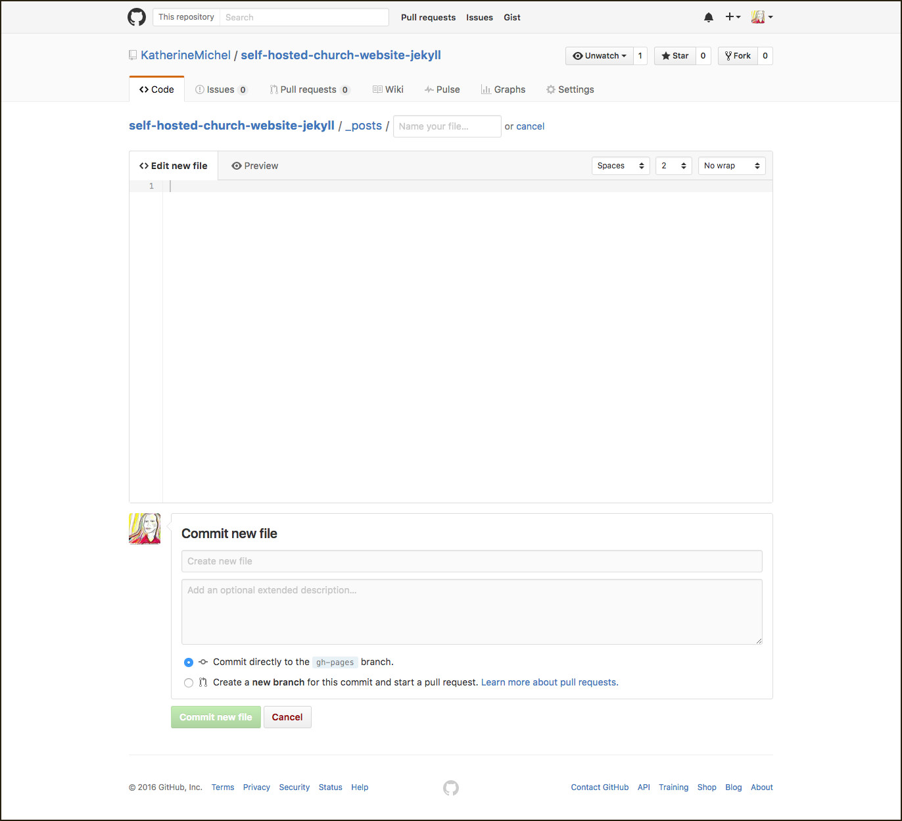
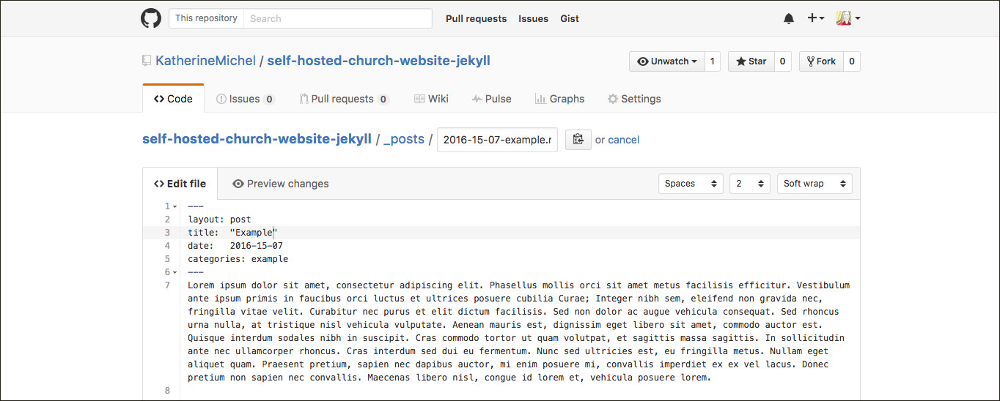
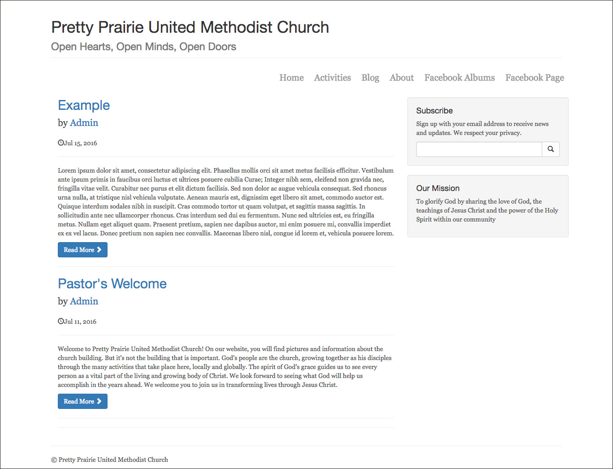
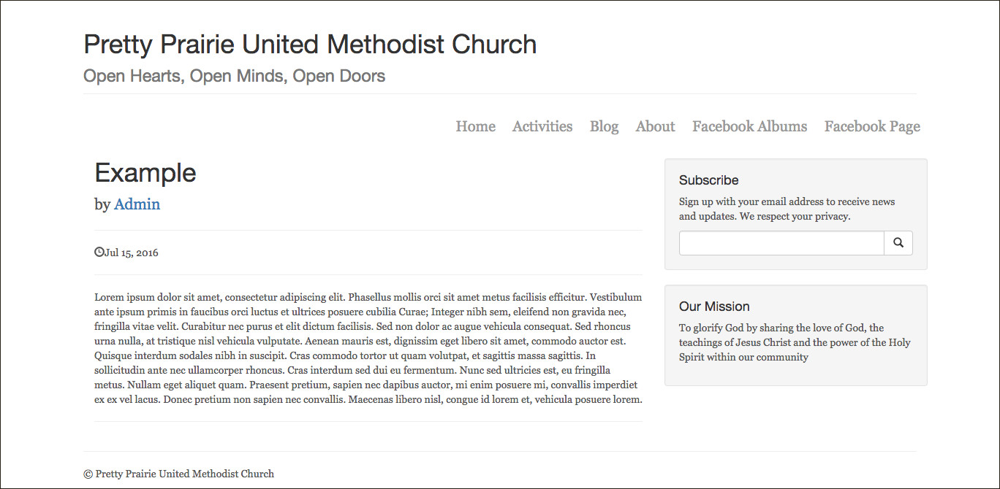

# Jekyll Admin

Though GitHub could looking intimidating at first, it can actually be simple to use. For instance, creating a new blog post is not any more difficult than creating a new Microsoft Word document, writing some text and saving it. For the website described in this GitBook, it is expected that the majority of the code-base will remain unchanged. The routine updates that need to be made can be made by non-developers in an isolated area of the code through a documented process, for example, occasionally adding a new blog post using the process described below.

Note: after this website and tutorial were originally made, [Jekyll Admin](https://github.com/jekyll/jekyll-admin) was created. Jekyll Admin may be the subject of a future update to this tutorial.  

## Getting Started

Website admins will need to have their own personal GitHub account. If the website is hosted in an organization acount, website admins will need to be members of the organization to have admin privileges.   

## Process

Here are the steps for a person who is an account owner or organization member to make a new blog post in Jekyll: 

In GitHub, navigate to the website repo and double click the name to open the repo

For a non-root gh-pages repo (does not end in github.io) choose the gh-pages branch (the account website root will be in its own repo, with a name ending in github.io and will be the master branch)

Click on the _posts folder to open it

Click on the "yyyy-mm-dd-post-template.markdown" file to open it

Select all, copy the contents of the post template (control-c, or command-c on a Mac), then click "Cancel" to navigate out of the file without making any change; alternatively, click "Raw", select all, (control-c, or command-c on a Mac), then back button

Click the "Create new file" button in the upper right

A new file will open

Paste the contents of the blog post template into the new file

In the "Name your file" box, using the exact format (yyyy-mm-dd-blog-post-title.markdown), input the year, month, day, then blog post title, separated by hyphens (exclude other punctuation from the title such as apostrophes). In the body of the file, replace the generic "front matter" with the information for this blog post (for example: change Title to the real title); under the "front matter," type or copy and paste your blog post text. If you do compose your post directly in the file, keep in mind that you may want to copy and save the body before clicking "Commit new file" so that if the browser has a connection error, your work is not lost.

When you are happy with your post, scroll to the bottom of the page. Optionally, leave a commit message. Click the green "Commit new file" button

The post will automatically populate a blog post description on the Blog homepage with a link to an automatically populated blog post page

Example post on Blog homepage

Blog post page

## Staged Deployment

In a mission critical, live production environment, a website may be updated and viewed locally (offline, on an individual computer), before the new code is pushed to the web host and viewed on a live staging site that is virtually the same as the live production site. If the result on the staging site is satisfactory, the change may be pushed to the live site where it will be seen by users. It is assumed that a website made using the approach given in this GitBook will be simple/low traffic enough that major updates could be verified locally and pushed directly to gh-pages. Minor changes, such as adding a blog post, could be completedly directly in GitHub via the browser. However, it is possible that a staging site could be created by making a staging branch, and merging the staging branch with the gh-pages branch. 
