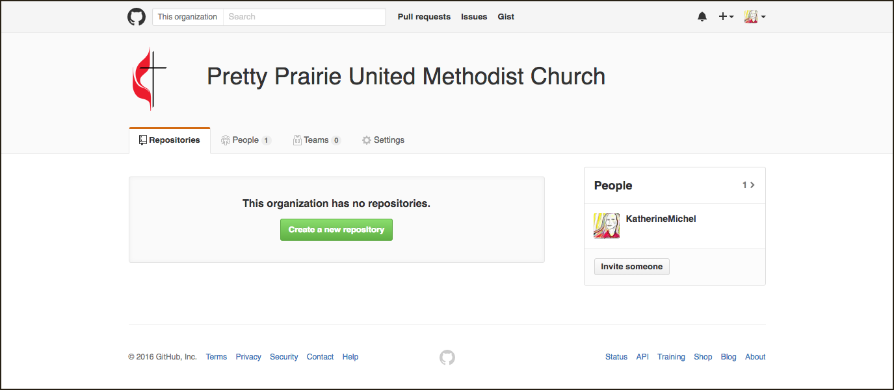
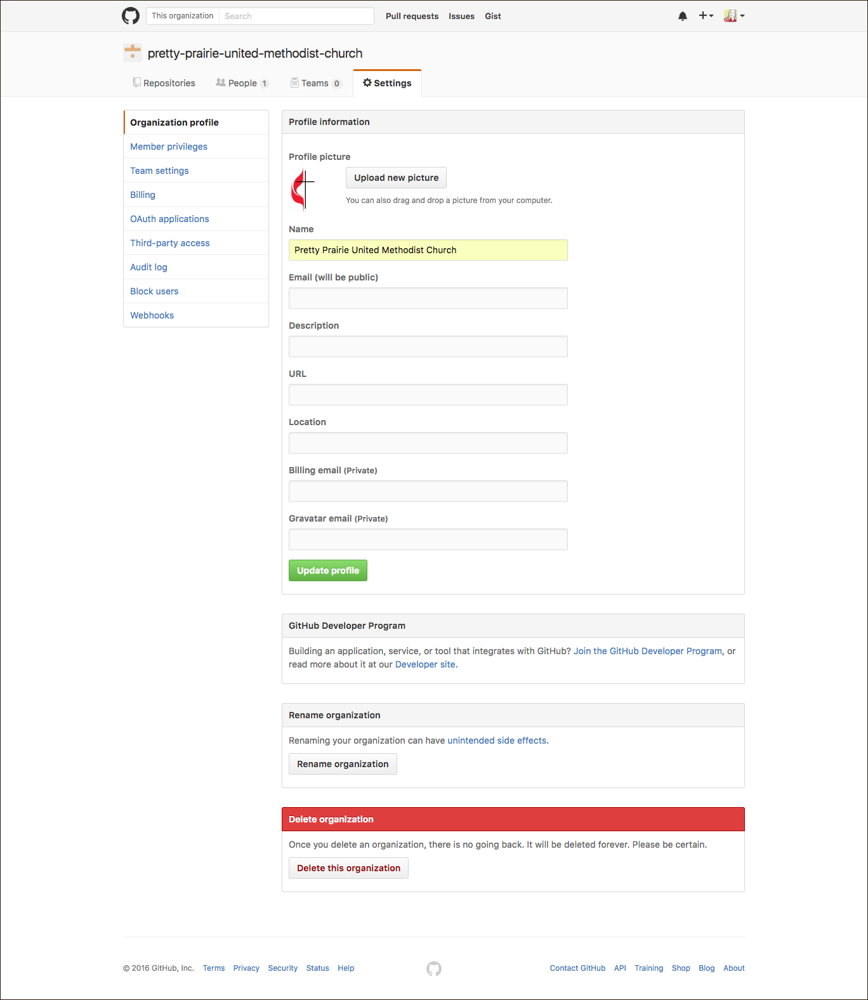
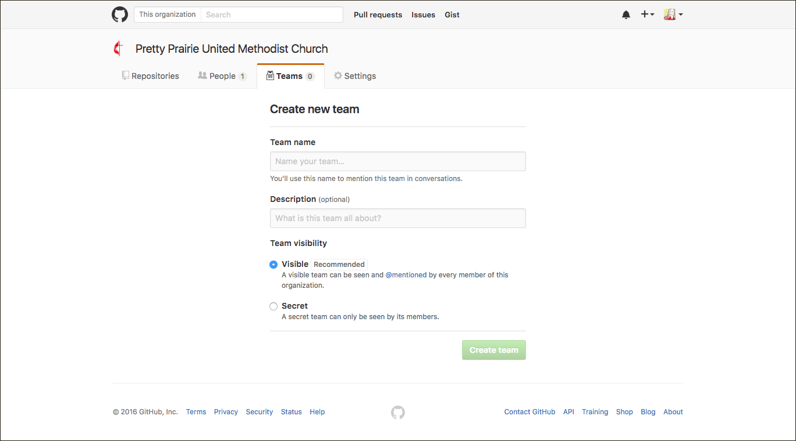

# Open-Source GitHub Organization

[GitHub](https://github.com) is the most popular place in the world for hosting open-source code. It's kind of like Facebook for developers. GitHub is a website built on top of the version control system Git. Linux Torvalds, the founder of Linus, a highly successful open-source operating system, created Git for his own use as the head maintainer of Linux, to coordinate contributions from developers around the world. Because Git is not user friendly, GitHub was created as a dashboard that would make using Git more user friendly. Code is stored in GitHub repos. Repos that are public can be looked through, learned from, and contributed to openly. 

Though GitHub could looking intimidating at first, it can actually be simple to use. GitHub can be used in two primary ways: through a personal account or an organizational account with members who have special privileges. A church could create an organizational account where a few people could access website code to make simple updates, such as publishing a new blog post. This will be further explained later in this GitBook as part of the Jekyll approach.

Below are screenshots showing what a hypothetical church GitHub organization would look like and the setup process. 

Church Organization Account with Me as Owner

Create a GitHub Organization

Invite Organization Members

Update the Settings with Proper Name and Profile Picture

Create a Team

